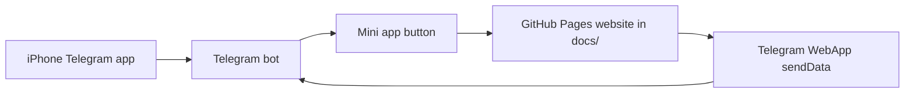

# Day Ping

Day Ping - маленький первый проект, чтобы понять, как устроено приложение для iPhone внутри Telegram.

В проекте две части:

- `docs/` - мобильный веб-интерфейс. GitHub Pages может опубликовать эту папку как HTTPS-сайт.
- `bot/` - простой Telegram-бот на Python. Он открывает мини-приложение и принимает данные обратно.

Официальные документы, которые стоит сохранить:

- регистрация GitHub: <https://docs.github.com/en/get-started/start-your-journey/creating-an-account-on-github>
- Telegram Bot API: <https://core.telegram.org/bots/api>
- Telegram Mini Apps: <https://core.telegram.org/bots/webapps>

## Что ты создаешь

Ты создаешь Telegram-бота с кнопкой. На iPhone кнопка открывает мини-приложение прямо внутри Telegram. Мини-приложение собирает три поля:

- настрой
- энергия
- главное дело дня

Потом оно отправляет результат обратно боту.

## Архитектура



Это учебная версия настоящей продуктовой архитектуры:

- frontend: экран, который видит пользователь
- integration: Telegram открывает приложение и передает сообщение
- backend: код бота, который получает данные и отвечает
- hosting: GitHub Pages публикует frontend
- secrets: токен бота не попадает в GitHub

## 1. Создай аккаунт GitHub

1. Открой <https://github.com/>.
2. Нажми **Sign up**.
3. Используй email, Google или Apple.
4. Подтверди email.
5. Включи двухфакторную защиту, когда GitHub предложит.

GitHub - место, где хранится история кода. Папка проекта на GitHub называется repository.

## 2. Создай repository

1. Нажми **New repository**.
2. Repository name: `day-ping`.
3. Visibility: **Public** - самый простой вариант для GitHub Pages.
4. Не добавляй README на GitHub, если загружаешь эту папку с компьютера.
5. Создай repository.

## 3. Загрузи проект

Из этой папки:

```bash
git init
git add .
git commit -m "Create Day Ping starter"
git branch -M main
git remote add origin git@github.com:erkanatemba/day-ping.git
git push -u origin main
```

Этот шаг уже сделан: проект загружен в <https://github.com/erkanatemba/day-ping>.

## 4. Опубликуй веб-приложение

1. Открой repository `day-ping` на GitHub.
2. Перейди в **Settings**.
3. Открой **Pages**.
4. Source: **Deploy from a branch**.
5. Branch: `main`.
6. Folder: `/docs`.
7. Сохрани.

После публикации ссылка будет такой:

```text
https://erkanatemba.github.io/day-ping/
```

## 5. Создай Telegram-бота

1. Открой Telegram.
2. Найди `@BotFather`.
3. Отправь `/newbot`.
4. Выбери имя, например `Day Ping`.
5. Выбери username, который заканчивается на `bot`, например `my_day_ping_bot`.
6. Скопируй токен, который даст BotFather.

Токен - как пароль. Его нельзя выкладывать в интернет.

## 6. Настрой бота локально

Скопируй пример файла настроек:

```bash
cp bot/.env.example bot/.env
```

Заполни `bot/.env`:

```text
BOT_TOKEN=the_token_from_botfather
WEB_APP_URL=https://erkanatemba.github.io/day-ping/
```

## 7. Запусти бота

```bash
python3 bot/main.py
```

Открой своего бота в Telegram и отправь:

```text
/start
```

Нажми **Открыть Day Ping**, заполни мини-приложение и отправь результат.

## На что смотрит IT-архитектор

Архитектор спрашивает не только "код запускается?". Он спрашивает:

- Кто пользователь?
- На каких устройствах должно работать?
- Где живут данные?
- Какая часть системы с какой частью разговаривает?
- Что сломается, если Telegram, GitHub Pages или твой компьютер недоступны?
- Какие секреты нельзя публиковать?
- Как мы проверяем, что все работает?
- Как безопасно выкатывать новую версию?
- Что изменится, если 10 пользователей станут 10 000?

Честное ограничение первой версии: бот работает на твоем компьютере. Потом его можно перенести на облачный сервер, чтобы он был доступен постоянно.
